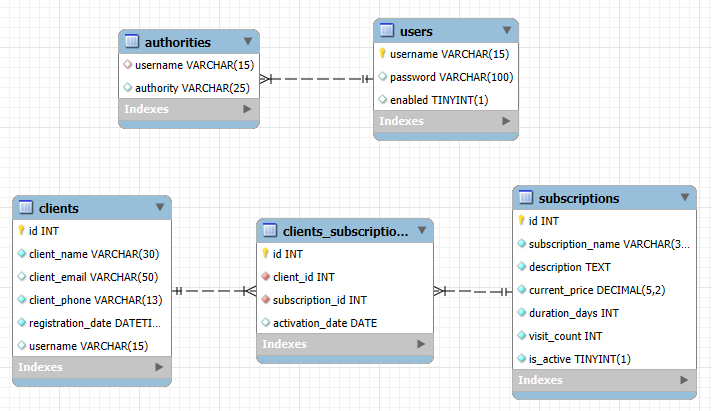
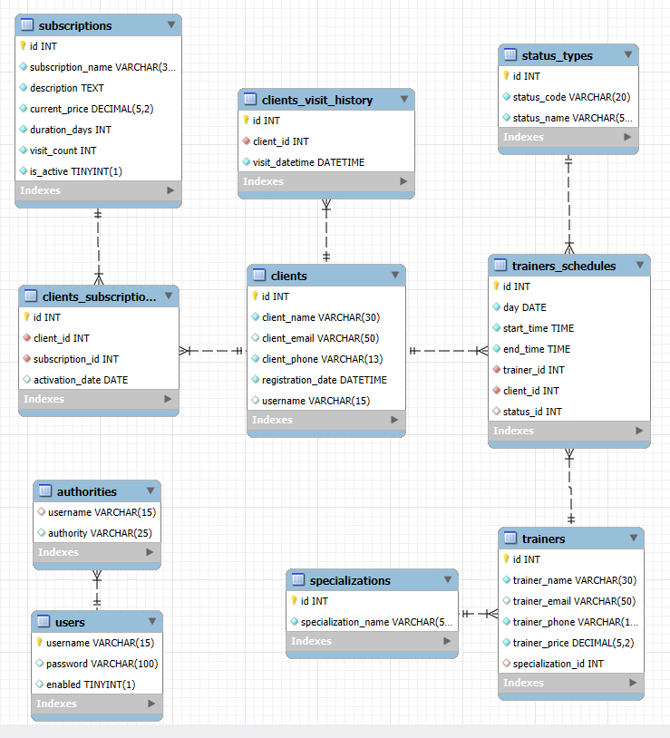

# Fitness Club Management System

## Краткое описание

Проект представляет собой REST-API для управления данными фитнес-клуба.  
Система поддерживает два типа пользователей:

- **Клиенты** — могут регистрироваться, просматривать и редактировать профиль, а также отслеживать свои абонементы.
- **Администраторы** — управляют клиентами, абонементами и связями между ними.

Проект ориентирован на демонстрацию архитектурных решений, валидации, обработки ошибок и тестирования. Он не предназначен для запуска в продакшн-среде.

---

## Используемые технологии

- **Java 17**
- **Spring Boot (Web)** — реализация REST-контроллеров
- **Spring Security** — разграничение доступа по ролям
- **MySQL** — модель хранения данных
- **Jakarta Persistence (JPA) / Hibernate** — ORM и аннотации сущностей
- **Jakarta Bean Validation** — стандартные и кастомные аннотации валидации
- **JUnit 5**, **Mockito**, **AssertJ** — модульное тестирование
- **Maven** — сборка проекта и управление зависимостями

---
## Запуск через Docker

### Предварительные шаги

Убедитесь, что установлены:

- [Docker](https://www.docker.com/)
- [Docker Compose](https://docs.docker.com/compose/)

Клонируйте репозиторий:

```bash
git clone https://github.com/alina-guzova/fitness-club-management-system.git
cd fitness-club-management-system
```

### Запуск контейнеров

```bash
docker-compose up --build
```
Это создаст два контейнера: `app` (Spring Boot) и `db` (MySQL 8).  
Приложение будет доступно по адресу: [http://localhost:8080](http://localhost:8080)


### Инициализация базы данных

После запуска контейнеров необходимо вручную выполнить SQL-скрипт `init.sql`, чтобы создать таблицы и заполнить их данными.
Убедитесь, что файл `init.sql` находится в папке `db-init` в корне проекта.

#### Через **cmd.exe** (Windows):

```bash
docker exec -i fitness-club-management-system-db-1 mysql -u root -p1003 fitness_club < db-init\init.sql
```
#### Через **Git Bash**:

```bash
docker exec -i fitness-club-management-system-db-1 mysql -u root -p1003 fitness_club < ./db-init/init.sql
```
> ⚠️ При необходимости настройте SPRING_DATASOURCE_URL в docker-compose.yml для подключения к внешнему контейнеру.
---
## Архитектура проекта

#### Роли и зоны доступа

- `ADMIN` — доступ к административным эндпоинтам (`/api/admin/**`)
- `CLIENT` — доступ к личному кабинету клиента (`/api/client/**`)
- `common` — публичная зона без авторизации (`/api/common/**`), доступна всем пользователям

#### Основные сущности

- `Client` — пользователь системы
- `Subscription` — абонемент фитнес-клуба
- `ClientSubscription` — связь клиента с абонементом

#### Физическая модель данных



### Слои и компоненты
Проект построен по принципу многослойной архитектуры с чётким разделением ответственности:

- **Контроллеры (`controller`)**
    - `admin` — управление клиентами и подписками
    - `client` — профиль и абонементы клиента
    - `common` — публичный доступ: регистрация, просмотр подписок

- **Сервисы (`service`)**
    - `admin`, `client`, `common` — бизнес-логика по зонам ответственности

- **Репозитории (`repository`)**
    - Spring Data JPA-интерфейсы для доступа к данным

- **DTO (`dto`)**
    - Структурированы по доменам: `client`, `client_subscription`, `subscription`
    - Содержат аннотации валидации и архитектурные комментарии

- **Сущности (`entity`)**
    - `Client`, `Subscription`, `ClientSubscription`

- **Мапперы (`mapper`)**
    - Преобразование между DTO и сущностями

- **Валидация (`validation`)**
    - Стандартные аннотации: `@NotNull`, `@Email`, `@Size`
    - Кастомные аннотации: `@ValidEmail`, `@ValidPrice`, `@PhoneNumber`
    - Кастомные валидаторы: `EmailValidator`, `PriceValidator`, `PhoneNumberValidator`

- **Обработка ошибок (`exception_handling`)**
    - `GlobalExceptionHandler` с `@RestControllerAdvice`
    - Кастомные исключения: `NoSuchClientException`, `NoSuchSubscriptionException`, `NoSuchClientSubscriptionException`
    - Единый формат ответа: `ErrorResponse`

- **Спецификации (`specification`)**
    - Фильтрация подписок через `SubscriptionSpecification`

- **Безопасность (`configuration`)**
    - `SecurityConfig` — разграничение доступа
    - Кастомные обработчики: `CustomAccessDeniedHandler`, `CustomAuthenticationEntryPoint`

- **Тесты (`test`)**
    - Покрытие сервисов: `ClientServiceImplTest`, `RegistrationServiceTest` и др.
    - Фабрики тестовых данных: `TestClientFactory`, `TestClientSubscriptionFactory`, `TestSubscriptionFactory`

---


## Работа системы от имени администратора (`ADMIN`)

### Авторизация и доступ

Доступ к административным эндпоинтам (`/api/admin/**`) разрешён только авторизованным пользователям с ролью `ADMIN`.

#### При отсутствии авторизации сервер возвращает ошибку:

```json
{
  "status": 401,
  "message": "Неавторизованный доступ",
  "timestamp": "2025-10-02T04:55:16.6486747",
  "details": [
    "Пожалуйста, войдите в систему или зарегистрируйтесь"
  ]
}
```
#### При недостаточных правах доступа:

Если пользователь вошёл в систему как клиент, но не обладает ролью `ADMIN`, сервер возвращает:

```json
{
  "status": 403,
  "message": "Доступ запрещен",
  "timestamp": "2025-10-02T18:55:40.97395",
  "details": [
    "У Вас недостаточно прав"
  ]
}
```

### Методы для работы с данными клиентов
> ⚠️ Войти как админ:
> <br>Логин: alina
> <br>Пароль: alina

<details>
<summary>Получение списка всех клиентов</summary>

<p><strong>Запрос:</strong></p>
<pre><code>GET /api/admin/clients
</code></pre>

<p><strong>Ответ:</strong></p>
<pre><code>[
  {
    "id": 5,
    "name": "Сидоров Игорь",
    "email": "sidorov@gmail.com",
    "phone": "+375291241412",
    "registrationDate": "2025-08-09T05:52:12"
  },
  {
    "id": 7,
    "name": "Николай Морозов",
    "email": "morozov.nikolay@mail.ru",
    "phone": "+375291705614",
    "registrationDate": "2025-08-09T05:52:12"
  },
  {
    "id": 8,
    "name": "Татьяна Кравцова",
    "email": "kravtsova.tatyana@gmail.com",
    "phone": "+375291112240",
    "registrationDate": "2025-08-09T05:52:12"
  }
  // ...
]
</code></pre>

</details>

<details>
<summary>Получение клиента по ID (успешный и ошибочный сценарий)</summary>

<p><strong>Запрос по существующему ID:</strong></p>
<pre><code>GET /api/admin/clients/7
</code></pre>

<p><strong>Ответ:</strong></p>
<pre><code>{
  "id": 7,
  "name": "Николай Морозов",
  "email": "morozov.nikolay@mail.ru",
  "phone": "+375291705614",
  "registrationDate": "2025-08-09T05:52:12"
}
</code></pre>

<p><strong>Запрос по несуществующему ID:</strong></p>
<pre><code>GET /api/admin/clients/100
</code></pre>

<p><strong>Ответ:</strong></p>
<pre><code>{
  "status": 404,
  "message": "Клиент с id = 100 не найден",
  "timestamp": "2025-10-02T04:48:12.0589926",
  "details": [
    "Проверьте корректность ID"
  ]
}
</code></pre>

</details>

<details>
<summary>Частичное обновление клиента по ID (успешный и ошибочный сценарий)</summary>

<p><strong>Запрос с корректными данными:</strong></p>
<pre><code>PATCH /api/admin/clients/7
Content-Type: application/json
</code></pre>

<p><strong>Тело запроса:</strong></p>
<pre><code>{
  "name": "Николай Сафонов",
  "email": "saphonov.nikolay@mail.ru",
  "phone": "  "
}
</code></pre>

<p><strong>Ответ:</strong></p>
<pre><code>{
  "id": 7,
  "name": "Николай Сафонов",
  "email": "saphonov.nikolay@mail.ru",
  "phone": "+375291705614",
  "registrationDate": "2025-08-09T05:52:12"
}
</code></pre>

> ⚠️ Если администратор передаёт пустую строку (`"phone": "  "`), поле не обновляется — значение в базе остаётся прежним.
> Это защищает от случайного затирания данных при частичном обновлении.

<p><strong>Запрос с некорректными данными (ошибка валидации):</strong></p>
<pre><code>PATCH /api/admin/clients/7
Content-Type: application/json
</code></pre>

<p><strong>Тело запроса:</strong></p>
<pre><code>{
  "email": "nikolay@ma",
  "phone": "+54454222445"
}
</code></pre>

<p><strong>Ответ:</strong></p>
<pre><code>{
  "status": 400,
  "message": "Ошибка валидации",
  "timestamp": "2025-10-02T05:18:18.5866699",
  "details": [
    "Поле 'phone': Некорректный формат номера телефона",
    "Поле 'email': Некорректный формат email"
  ]
}
</code></pre>

</details>

<details>
<summary>Удаление клиента по ID (успешный и ошибочный сценарий)</summary>

<p><strong>Запрос на удаление существующего клиента:</strong></p>
<pre><code>DELETE /api/admin/clients/25
</code></pre>

<p><strong>Ответ:</strong></p>
<pre><code>204 No Content
</code></pre>

<p><strong>Запрос на удаление несуществующего клиента:</strong></p>
<pre><code>DELETE /api/admin/clients/100
</code></pre>

<p><strong>Ответ:</strong></p>
<pre><code>{
  "status": 404,
  "message": "Клиент с id = 100 не найден",
  "timestamp": "2025-10-02T05:42:39.9956438",
  "details": [
    "Проверьте корректность ID"
  ]
}
</code></pre>

</details>

### Методы для работы с абонементами клуба

<details>
<summary>Получение списка доступных абонементов фитнес-клуба</summary>

<p><strong>Запрос:</strong></p>
<pre><code>GET /api/admin/subscriptions
</code></pre>

<p><strong>Ответ:</strong></p>
<pre><code>[
  {
    "id": 1,
    "name": "Базовый",
    "description": "Доступ в тренажёрный зал без ограничений по времени.",
    "price": 49.99,
    "durationDays": 30,
    "visitCount": 30,
    "isActive": true
  },
  {
    "id": 2,
    "name": "Премиум",
    "description": "Включает групповые занятия и бассейн.",
    "price": 89.99,
    "durationDays": 30,
    "visitCount": 40,
    "isActive": true
  },
  {
    "id": 3,
    "name": "Утренний",
    "description": "Доступ с 6:00 до 12:00 по будням.",
    "price": 39.99,
    "durationDays": 30,
    "visitCount": 25,
    "isActive": true
  }
  // ...
]
</code></pre>

</details>


<details>
<summary>Получение абонементов с фильтрацией и сортировкой</summary>

<p><strong>Запрос:</strong></p>
<pre><code>GET /api/admin/subscriptions?active=true&priceFrom=50&direction=desc&sortBy=price
</code></pre>

<p><strong>Пояснение:</strong></p>
<ul>
  <li><code>active=true</code> — только активные абонементы</li>
  <li><code>priceFrom=50</code> — цена от 50 и выше</li>
  <li><code>direction=desc</code> — сортировка по убыванию</li>
  <li><code>sortBy=price</code> — сортировка по цене</li>
</ul>

<p><strong>Ответ:</strong></p>
<pre><code>[
  {
        "id": 5,
        "name": "Годовой",
        "description": "Безлимитный доступ на 365 дней.",
        "price": 499.99,
        "durationDays": 365,
        "visitCount": 400,
        "isActive": true
    },
    {
        "id": 8,
        "name": "Интенсив",
        "description": "Доступ к персональным тренировкам.",
        "price": 119.99,
        "durationDays": 30,
        "visitCount": 20,
        "isActive": true
    },
    {
        "id": 2,
        "name": "Премиум",
        "description": "Включает групповые занятия и бассейн.",
        "price": 89.99,
        "durationDays": 30,
        "visitCount": 40,
        "isActive": true
    }
]
</code></pre>

</details>

<details>
<summary>Получение информации об абонементе по ID (успешный и ошибочный сценарий)</summary>

<p><strong>Запрос по существующему ID:</strong></p>
<pre><code>GET /api/admin/subscriptions/9
</code></pre>

<p><strong>Ответ:</strong></p>
<pre><code>{
  "id": 9,
  "name": "Релакс",
  "description": "Только бассейн и сауна.",
  "price": 59.99,
  "durationDays": 30,
  "visitCount": 15,
  "isActive": true
}
</code></pre>

<p><strong>Запрос по несуществующему ID:</strong></p>
<pre><code>GET /api/admin/subscriptions/100
</code></pre>

<p><strong>Ответ:</strong></p>
<pre><code>{
  "status": 404,
  "message": "Абонемент с id = 100 не найден",
  "timestamp": "2025-10-02T06:00:34.9431383",
  "details": [
    "Проверьте корректность ID"
  ]
}
</code></pre>

</details>

<details>
<summary>Создание нового абонемента (успешный и ошибочный сценарий)</summary>

<p><strong>Запрос с корректными данными:</strong></p>
<pre><code>POST /api/admin/subscriptions
Content-Type: application/json
</code></pre>

<p><strong>Тело запроса:</strong></p>
<pre><code>{
  "name": "Баланс",
  "description": "Чередование тренажёрного зала, йоги и сауны. Подходит для восстановления и поддержания формы.",
  "price": 210,
  "durationDays": 45,
  "visitCount": 20
}
</code></pre>

<p><strong>Ответ:</strong></p>
<pre><code>{
  "id": 17,
  "name": "Баланс",
  "description": "Чередование тренажёрного зала, йоги и сауны. Подходит для восстановления и поддержания формы.",
  "price": 210,
  "durationDays": 45,
  "visitCount": 20,
  "isActive": true
}
</code></pre>

<p><strong>Запрос с некорректными данными:</strong></p>
<pre><code>POST /api/admin/subscriptions
Content-Type: application/json
</code></pre>

<p><strong>Тело запроса:</strong></p>
<pre><code>{
  "name": "    ",
  "description": "",
  "price": 0,
  "durationDays": null,
  "visitCount": -1
}
</code></pre>

<p><strong>Ответ:</strong></p>
<pre><code>{
  "status": 400,
  "message": "Ошибка валидации",
  "timestamp": "2025-10-02T17:21:06.0297172",
  "details": [
    "Поле 'name': Имя не должно быть пустым",
    "Поле 'visitCount': должно быть не меньше 1",
    "Поле 'price': Цена от 0 до 999,99",
    "Поле 'durationDays': Срок действия должен быть указан",
    "Поле 'description': Описание не должно быть пустым"
  ]
}
</code></pre>

</details>

<details>
<summary>Частичное обновление абонемента по ID (успешный и ошибочный сценарий)</summary>

<p><strong>Запрос с частичным обновлением:</strong></p>
<pre><code>PATCH /api/admin/subscriptions/17
Content-Type: application/json
</code></pre>

<p><strong>Тело запроса:</strong></p>
<pre><code>{
  "name": "",
  "description": "Зал, групповые занятия, йога, сауна",
  "price": 199.99,
  "durationDays": 50
}
</code></pre>

<p><strong>Ответ:</strong></p>
<pre><code>{
  "id": 17,
  "name": "Баланс",
  "description": "Зал, групповые занятия, йога, сауна",
  "price": 199.99,
  "durationDays": 50,
  "visitCount": 20,
  "isActive": null
}
</code></pre>

> ⚠️ Пояснение: Пустое имя не обновляет поле — значение в базе остаётся прежним ("Баланс").
> Это защищает от случайного затирания данных при частичном обновлении.

<hr>

<p><strong>Запрос с некорректными данными:</strong></p>
<pre><code>PATCH /api/admin/subscriptions/17
Content-Type: application/json
</code></pre>

<p><strong>Тело запроса:</strong></p>
<pre><code>{
  "price": 0,
  "visitCount": 0
}
</code></pre>

<p><strong>Ответ:</strong></p>
<pre><code>{
  "status": 400,
  "message": "Ошибка валидации",
  "timestamp": "2025-10-02T17:35:31.0199915",
  "details": [
    "Поле 'price': Цена от 0 до 999,99",
    "Поле 'visitCount': должно быть не меньше 1"
  ]
}
</code></pre>

<hr>

<p><strong>Запрос с несуществующим ID:</strong></p>
<pre><code>PATCH /api/admin/subscriptions/100
Content-Type: application/json
</code></pre>

<p><strong>Тело запроса:</strong></p>
<pre><code>{
  "visitCount": 35
}
</code></pre>

<p><strong>Ответ:</strong></p>
<pre><code>{
  "status": 404,
  "message": "Абонемент с id = 100 не найден",
  "timestamp": "2025-10-02T17:51:40.9220208",
  "details": [
    "Проверьте корректность ID"
  ]
}
</code></pre>

</details>

<details>
<summary>Деактивация абонемента по ID (снятие с продажи)</summary>

<p><strong>Запрос на деактивацию существующего абонемента:</strong></p>
<pre><code>PATCH /api/admin/subscriptions/17/deactivate
</code></pre>

<p><strong>Ответ:</strong></p>
<pre><code>200 OK
</code></pre>

<hr>

<p><strong>Запрос на деактивацию по несуществующему ID:</strong></p>
<pre><code>PATCH /api/admin/subscriptions/100/deactivate
</code></pre>

<p><strong>Ответ:</strong></p>
<pre><code>{
  "status": 404,
  "message": "Абонемент с id = 100 не найден",
  "timestamp": "2025-10-02T17:46:54.1369956",
  "details": [
    "Проверьте корректность ID"
  ]
}
</code></pre>

</details>

<details>
<summary>Удаление абонемента по ID (успешный и ошибочный сценарий)</summary>

<p><strong>Запрос на удаление существующего абонемента:</strong></p>
<pre><code>DELETE /api/admin/subscriptions/17
</code></pre>

<p><strong>Ответ:</strong></p>
<pre><code>204 No Content
</code></pre>

<p><strong>Запрос на удаление несуществующего абонемента:</strong></p>
<pre><code>DELETE /api/admin/subscriptions/100
</code></pre>

<p><strong>Ответ:</strong></p>
<pre><code>{
  "status": 404,
  "message": "Абонемент с id = 100 не найден",
  "timestamp": "2025-10-02T17:56:25.8264731",
  "details": [
    "Проверьте корректность ID"
  ]
}
</code></pre>

</details>

### Методы для работы с абонементами клиентов

<details>
<summary>Просмотр клиентских подписок по ID клиента (с сортировкой и ошибочным сценарием)</summary>

<p><strong>Запрос:</strong></p>
<pre><code>GET /api/admin/client-subscriptions/client/7
</code></pre>

<p><strong>Ответ:</strong></p>
<pre><code>{
  "client": {
    "id": 7,
    "name": "Николай Сафонов",
    "email": "saphonov.nikolay@mail.ru",
    "phone": "+375291705614",
    "registrationDate": "2025-08-09T05:52:12"
  },
  "clientSubscriptions": [
    {
      "clientSubscriptionId": 14,
      "name": "Студенческий",
      "description": "Скидка для студентов, доступ по будням.",
      "price": 34.99,
      "durationDays": 30,
      "visitCount": 30,
      "activationDate": null,
      "expirationDate": null
    },
    {
      "clientSubscriptionId": 13,
      "name": "Годовой",
      "description": "Безлимитный доступ на 365 дней.",
      "price": 499.99,
      "durationDays": 365,
      "visitCount": 400,
      "activationDate": "2025-09-28",
      "expirationDate": "2026-09-28"
    },
    {
      "clientSubscriptionId": 11,
      "name": "Интенсив",
      "description": "Доступ к персональным тренировкам.",
      "price": 119.99,
      "durationDays": 30,
      "visitCount": 20,
      "activationDate": "2025-09-28",
      "expirationDate": "2025-10-28"
    }
  ]
}
</code></pre>

> ⚠️ Сортировка:
> - Сначала идут неактивированные подписки (`activationDate = null`)
> - Затем активированные, отсортированные по `expirationDate` в порядке убывания — от актуальных к истекшим


<p><strong>Запрос с несуществующим ID клиента:</strong></p>
<pre><code>GET /api/admin/client-subscriptions/client/100
</code></pre>

<p><strong>Ответ:</strong></p>
<pre><code>{
  "status": 404,
  "message": "Клиент с id = 100 не найден",
  "timestamp": "2025-10-02T18:30:26.1755925",
  "details": [
    "Проверьте корректность ID"
  ]
}
</code></pre>

</details>

<details>
<summary>Регистрация клиентской подписки (успешный и ошибочные сценарии)</summary>

<p><strong>Запрос на создание связи:</strong></p>
<pre><code>POST /api/admin/client-subscriptions
Content-Type: application/json
</code></pre>

<p><strong>Тело запроса:</strong></p>
<pre><code>{
  "clientId": 7,
  "subscriptionId": 12
}
</code></pre>

<p><strong>Ответ:</strong></p>
<pre><code>204 No Content
</code></pre>

---

<p><strong>Запрос по несуществующему ID клиента</strong></p>
<pre><code>POST /api/admin/client-subscriptions
Content-Type: application/json
</code></pre>

<p><strong>Тело запроса:</strong></p>
<pre><code>{
  "clientId": 100,
  "subscriptionId": 9
}
</code></pre>

<p><strong>Ответ:</strong></p>
<pre><code>{
  "status": 404,
  "message": "Клиент с id = 100 не найден",
  "timestamp": "2025-10-02T18:14:31.5746336",
  "details": [
    "Проверьте корректность ID"
  ]
}
</code></pre>

---

<p><strong>Запрос по несуществующему ID абонемента</strong></p>
<pre><code>POST /api/admin/client-subscriptions
Content-Type: application/json
</code></pre>

<p><strong>Тело запроса:</strong></p>
<pre><code>{
  "clientId": 7,
  "subscriptionId": 100
}
</code></pre>

<p><strong>Ответ:</strong></p>
<pre><code>{
  "status": 404,
  "message": "Абонемент с id = 100 не найден",
  "timestamp": "2025-10-02T18:15:15.0476269",
  "details": [
    "Проверьте корректность ID"
  ]
}
</code></pre>

</details>

<details>
<summary>Активация клиентской подписки по ID</summary>

<p><strong>Запрос на активацию существующей подписки:</strong></p>
<pre><code>PATCH /api/admin/client-subscriptions/14/activate
</code></pre>

<p><strong>Ответ:</strong></p>
<pre><code>204 No Content
</code></pre>


<p><strong>Запрос на активацию несуществующей подписки:</strong></p>
<pre><code>PATCH /api/admin/client-subscriptions/100/activate
</code></pre>

<p><strong>Ответ:</strong></p>
<pre><code>{
  "status": 404,
  "message": "Абонемент с id = 100 не найден",
  "timestamp": "2025-10-02T18:36:12.356762",
  "details": [
    "Проверьте корректность ID"
  ]
}
</code></pre>

</details>

<details>
<summary>Деактивация клиентской подписки по ID</summary>

<p><strong>Запрос на деактивацию существующей подписки:</strong></p>
<pre><code>PATCH /api/admin/client-subscriptions/14/deactivate
</code></pre>

<p><strong>Ответ:</strong></p>
<pre><code>204 No Content
</code></pre>


<p><strong>Запрос на деактивацию несуществующей подписки:</strong></p>
<pre><code>PATCH /api/admin/client-subscriptions/100/deactivate
</code></pre>

<p><strong>Ответ:</strong></p>
<pre><code>{
  "status": 404,
  "message": "Абонемент с id = 100 не найден",
  "timestamp": "2025-10-02T18:38:58.0637057",
  "details": [
    "Проверьте корректность ID"
  ]
}
</code></pre>

</details>


<details>
<summary>Удаление клиентской подписки по ID</summary>

<p><strong>Запрос на удаление существующей записи:</strong></p>
<pre><code>DELETE /api/admin/client-subscriptions/15
</code></pre>

<p><strong>Ответ:</strong></p>
<pre><code>204 No Content
</code></pre>

<p><strong>Запрос на удаление несуществующей записи (успешный и ошибочные сценарии):</strong></p>
<pre><code>DELETE /api/admin/client-subscriptions/100
</code></pre>

<p><strong>Ответ:</strong></p>
<pre><code>{
  "status": 404,
  "message": "Абонемент с id = 100 не найден",
  "timestamp": "2025-10-02T18:23:08.8016194",
  "details": [
    "Проверьте корректность ID"
  ]
}
</code></pre>

</details>


> ▶️ Описание функций свернуто для удобства. Нажмите на заголовок, чтобы раскрыть примеры запросов и ответов.

---

## Работа системы от имени клиента (`CLIENT`)

### Авторизация и доступ

Доступ к клиентским эндпоинтам (`/api/client/**`) разрешён только авторизованным пользователям с ролью `CLIENT`.

#### При отсутствии авторизации сервер возвращает ошибку:

```json
{
  "status": 401,
  "message": "Неавторизованный доступ",
  "timestamp": "2025-10-02T04:55:16.6486747",
  "details": [
    "Пожалуйста, войдите в систему или зарегистрируйтесь"
  ]
}
```
#### При недостаточных правах доступа:

Если пользователь вошёл в систему как администратор, но не обладает ролью `CLIENT`, сервер возвращает:

```json
{
  "status": 403,
  "message": "Доступ запрещен",
  "timestamp": "2025-10-02T18:55:40.97395",
  "details": [
    "У Вас недостаточно прав"
  ]
}
```
### Управление своим профилем
> ⚠️ Войти как клиент:
> <br>Логин: nikolai
> <br>Пароль: nikolai

<details>
<summary>Просмотр собственного профиля (успешный и ошибочный сценарий) </summary>

<p><strong>Запрос с существующим профилем:</strong></p>
<pre><code>GET /api/client/profile
</code></pre>

<p><strong>Ответ:</strong></p>
<pre><code>{
  "name": "Николай Сафонов",
  "email": "saphonov.nikolay@mail.ru",
  "phone": "+375291705614"
}
</code></pre>

> ⚠️ Клиент получает только свои данные — без ID, даты регистрации или других системных атрибутов.
> Эндпоинт доступен только авторизованным пользователям с ролью `CLIENT`.

<p><strong>Запрос удаленного профиля:</strong></p>
<pre><code>GET /api/client/profile
</code></pre>

<p><strong>Ответ:</strong></p>
<pre><code>{
  "status": 404,
  "message": "Клиент с username = 'leon' не найден",
  "timestamp": "2025-10-02T19:13:49.6686113",
  "details": [
    "Проверьте корректность username"
  ]
}
</code></pre>

> ⚠️ Аутентификация прошла успешно — логин и пароль корректны, но профиль клиента отсутствует в таблице <code>clients</code>. Это может происходить, если клиент был удалён, но его учётная запись в <code>users</code> осталась.

</details>

<details>
<summary>Редактирование собственного профиля (успешный и ошибочный сценарий)</summary>

<p><strong>Запрос с обновлением данных:</strong></p>
<pre><code>PATCH /api/client/profile
Content-Type: application/json
</code></pre>

<p><strong>Тело запроса:</strong></p>
<pre><code>{
  "name": "Николай Морозов",
  "email": "moroz.nikolay@mail.ru"
}
</code></pre>

<p><strong>Ответ:</strong></p>
<pre><code>{
  "name": "Николай Морозов",
  "email": "moroz.nikolay@mail.ru",
  "phone": "+375291705614"
}
</code></pre>

> ⚠️ Обновлены только указанные поля. Телефон остался прежним, так как не передавался в теле запроса.

<hr>

<p><strong>Запрос с некорректными данными:</strong></p>
<pre><code>PATCH /api/client/profile
Content-Type: application/json
</code></pre>

<p><strong>Тело запроса:</strong></p>
<pre><code>{
  "name": "",
  "email": "@mail.ru"
}
</code></pre>

<p><strong>Ответ:</strong></p>
<pre><code>{
  "status": 400,
  "message": "Ошибка валидации",
  "timestamp": "2025-10-02T19:27:31.4191186",
  "details": [
    "Поле 'email': Некорректный формат email"
  ]
}
</code></pre>

> ⚠️ Пояснение: Пустое имя не обновляет поле, а email не проходит валидацию — запрос отклонён.

</details>

<details>
<summary>Просмотр списка абонементов</summary>

<p><strong>Запрос:</strong></p>
<pre><code>GET /api/client/profile/subscriptions
</code></pre>

<p><strong>Ответ:</strong></p>
<pre><code>[
  {
    "name": "Выходной",
    "durationDays": 30,
    "visitCount": 8,
    "activationDate": "2025-09-28",
    "expirationDate": "2025-10-28"
  },
  {
    "name": "Годовой",
    "durationDays": 365,
    "visitCount": 400,
    "activationDate": "2025-09-28",
    "expirationDate": "2026-09-28"
  },
  {
    "name": "Студенческий",
    "durationDays": 30,
    "visitCount": 30,
    "activationDate": null,
    "expirationDate": null
  }
]
</code></pre>

> ⚠️ Клиент получает только те абонементы, которые ещё действуют или не были активированы вовсе (<code>activationDate = null</code>). 
> Абонементы с истекшим сроком действия скрываются из ответа.

</details>


> ▶️ Описание функций свернуто для удобства. Нажмите на заголовок, чтобы раскрыть примеры запросов и ответов.

---
## Работа системы без авторизации (публичный доступ)

### Авторизация и доступ

Доступ к публичным эндпоинтам (`/api/common/**`) разрешён всем пользователям — вне зависимости от роли или факта авторизации.

### Публичные функции

<details>
<summary>Регистрация нового клиента (успешный и ошибочный сценарий)</summary>

<p><strong>Запрос с корректными данными:</strong></p>
<pre><code>POST /api/common/register
Content-Type: application/json
</code></pre>

<p><strong>Тело запроса:</strong></p>
<pre><code>{
  "name": "Игорь Лаптев",
  "email": "laptev.igor@mail.ru",
  "phone": "+375293456789",
  "username": "igorlaptev",
  "password": "LaptevSecure456!"
}
</code></pre>

<p><strong>Ответ:</strong></p>
<pre><code>200 OK
</code></pre>

> ✅ Регистрация прошла успешно. Клиент может авторизоваться и работать с личным профилем.

<hr>

<p><strong>Запрос с некорректными данными:</strong></p>
<pre><code>POST /api/common/register
Content-Type: application/json
</code></pre>

<p><strong>Тело запроса:</strong></p>
<pre><code>{
  "name": "",
  "email": null,
  "phone": "+3752989",
  "username": "igorlaptev",
  "password": "LaptevSecure456!"
}
</code></pre>

<p><strong>Ответ:</strong></p>
<pre><code>{
  "status": 400,
  "message": "Ошибка валидации",
  "timestamp": "2025-10-02T20:01:02.6517854",
  "details": [
    "Поле 'phone': Некорректный формат номера телефона",
    "Поле 'name': Имя не должно быть пустым"
  ]
}
</code></pre>

</details>

<details>
<summary>Просмотр списка абонементов в продаже</summary>

<p><strong>Запрос:</strong></p>
<pre><code>GET /api/common/subscriptions
</code></pre>

<p><strong>Ответ:</strong></p>
<pre><code>[
  {
    "name": "Базовый",
    "description": "Доступ в тренажёрный зал без ограничений по времени.",
    "price": 49.99,
    "durationDays": 30,
    "visitCount": 30
  },
  {
    "name": "Премиум",
    "description": "Включает групповые занятия и бассейн.",
    "price": 89.99,
    "durationDays": 30,
    "visitCount": 40
  },
  {
    "name": "Утренний",
    "description": "Доступ с 6:00 до 12:00 по будням.",
    "price": 39.99,
    "durationDays": 30,
    "visitCount": 25
  },
  {
    "name": "Выходной",
    "description": "Только суббота и воскресенье.",
    "price": 29.99,
    "durationDays": 30,
    "visitCount": 8
  }
]
</code></pre>

</details>

> ▶️ Описание функций свернуто для удобства. Нажмите на заголовок, чтобы раскрыть примеры запросов и ответов.

---
## Тестирование

Проект покрыт unit-тестами для сервисного слоя, сгруппированными по зонам доступа и назначению
### Структура тестов

- **Административная зона (`service.admin`)**  
  Тесты охватывают управление клиентами, подписками и административные сценарии:  
  `ClientServiceImplTest`, `ClientSubscriptionServiceImplTest`, `SubscriptionServiceImplTest`

- **Клиентская зона (`service.client`)**  
  Проверяется логика работы с профилем клиента:  
  `ClientProfileServiceImplTest`

- **Общие сервисы (`service.common`)**  
  Тестируются публичные сценарии и регистрация новых пользователей:  
  `PublicSubscriptionServiceTest`, `RegistrationServiceTest`

- **Тестовые фабрики (`testutil`)**  
  Используются для генерации валидных и граничных тестовых данных:  
  `TestClientFactory`, `TestClientSubscriptionFactory`, `TestSubscriptionFactory`

### Подход к тестированию

- Используются **JUnit 5** и **Mockito** для мокирования зависимостей и изоляции логики
- Тестируются как **успешные**, так и **ошибочные** сценарии
- Проверяются бизнес-правила, валидации и поведение при исключениях
- Тесты не зависят от базы данных и не требуют запуска приложения

---
### Архивированные сущности

Следующие сущности были спроектированы, но не вошли в текущую реализацию:

- `ScheduleStatus`
- `SessionStatusType`
- `Specialization`
- `Trainer`
- `TrainerSchedule`
- `VisitHistory`

Они расположены в папке [`archived`](./src/main/java/.../archived) и могут быть использованы при масштабировании системы.

### Расширенная модель данных



> Изображение отражает полную структуру базы данных, включая как используемые, так и архивированные сущности.

---
## Лицензия

Проект распространяется под лицензией **Educational License © 2025 Alina Guzova**.

Запрещено коммерческое использование, переименование и упоминание без указания автора.

Полный текст лицензии — в [`LICENSE`](./LICENSE).  
Контакт: alinagomel583@gmail.com
